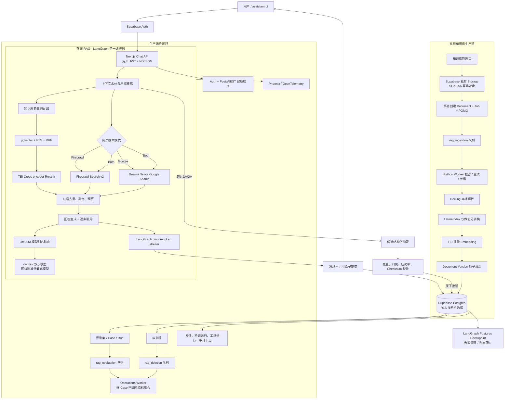

# Open RAG 生产流程图

```mermaid
flowchart TB
  U["用户 / assistant-ui"] --> AUTH["Supabase Auth"]
  AUTH --> API["Next.js Chat API<br/>用户 JWT + NDJSON"]

  subgraph ONLINE["在线 RAG · LangGraph 单一编排层"]
    API --> CTX["上下文水位与压缩策略"]
    CTX --> KB["知识库多查询召回"]
    KB --> HYBRID["pgvector + FTS + RRF"]
    HYBRID --> RERANK["TEI Cross-encoder Rerank"]
    CTX --> ROUTER{"网页搜索模式"}
    ROUTER -->|"Firecrawl"| FC["Firecrawl Search v2"]
    ROUTER -->|"Google"| GS["Gemini Native Google Search"]
    ROUTER -->|"Both"| FC
    ROUTER -->|"Both"| GS
    RERANK --> MERGE["证据去重、融合、预算"]
    FC --> MERGE
    GS --> MERGE
    MERGE --> GEN["回答生成 + 逐条引用"]
    GEN --> LLM["LiteLLM 模型别名路由"]
    LLM --> GEMINI["Gemini 默认模型<br/>可替换其他兼容模型"]
    GEN --> STREAM["LangGraph custom token stream"]
  end

  STREAM --> COMMIT["消息 + 引用原子提交"]
  COMMIT --> DB[("Supabase Postgres<br/>RLS 多租户数据")]
  COMMIT --> U
  CTX -->|"越过硬水位"| SUMMARY["候选结构化摘要"]
  SUMMARY --> VALIDATE["覆盖、归属、压缩率、Checksum 校验"]
  VALIDATE -->|"原子激活"| DB
  DB --> CHECKPOINT["LangGraph Postgres Checkpoint<br/>失败恢复 / 时间旅行"]

  subgraph INGEST["离线知识库生产链"]
    ADMIN["知识库管理页"] --> STORAGE["Supabase 私有 Storage<br/>SHA-256 幂等对象"]
    STORAGE --> ENQUEUE["事务创建 Document + Job + PGMQ"]
    ENQUEUE --> IQ["rag_ingestion 队列"]
    IQ --> WORKER["Python Worker 抢占 / 重试 / 死信"]
    WORKER --> DOCLING["Docling 本地解析"]
    DOCLING --> SPLIT["LlamaIndex 仅做切分转换"]
    SPLIT --> EMBED["TEI 批量 Embedding"]
    EMBED --> ACTIVATE["Document Version 原子激活"]
    ACTIVATE --> DB
  end

  subgraph OPS["生产运维闭环"]
    DB --> EVAL["评测集 / Case / Run"]
    EVAL --> EQ["rag_evaluation 队列"]
    EQ --> OPW["Operations Worker<br/>逐 Case 回归与指标聚合"]
    DB --> DELETE["软删除"]
    DELETE --> DQ["rag_deletion 队列"]
    DQ --> OPW
    API --> HEALTH["Auth + PostgREST 健康检查"]
    ONLINE --> TRACE["Phoenix / OpenTelemetry"]
    DB --> AUDIT["反馈、检索运行、工具运行、审计日志"]
  end
```

边界说明：普通模型调用一律走 LiteLLM；Gemini 原生 Google Search 因 grounding 工具协议限制独立调用。LlamaIndex 不参与在线 Agent/Graph 编排。
